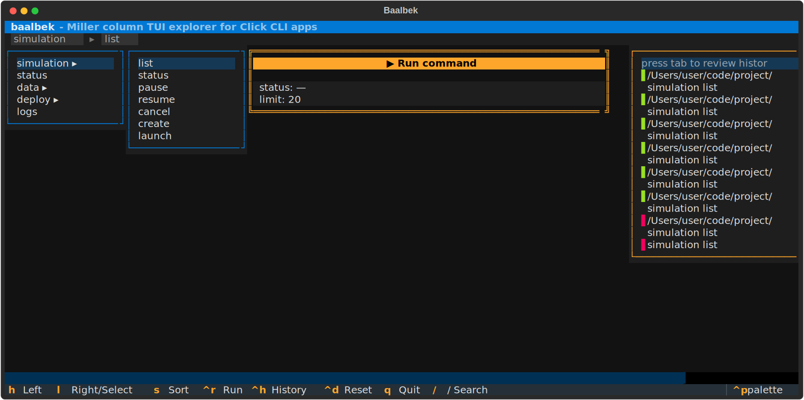

# Baalbek

A Miller column TUI explorer for [Click](https://click.palletsprojects.com/) CLI apps, built with [Textual](https://textual.textualize.io/).

Navigate your CLI's command tree with vim-style keybindings, preview subcommands and options in real time, and build up commands interactively.



## Install

Add to your `pyproject.toml` dependencies:

```toml
"baalbek @ git+https://github.com/anateus/baalbek"
```

PyPI publishing coming soon.

## Usage

```python
import click
from baalbek import tui

@tui()
@click.group()
def cli():
    pass

# ... define your commands ...

if __name__ == "__main__":
    cli()
```

Then run `cli tui` to launch the interactive explorer.

## Keybindings

| Key | Action |
|-----|--------|
| `h` / `←` | Move focus left |
| `l` / `→` / `Enter` | Move focus right / select |
| `j` / `↓` | Move cursor down |
| `k` / `↑` | Move cursor up |
| `s` / `S` | Cycle sort mode / reverse sort |
| `/` | Fuzzy search within focused column |
| `Ctrl+R` | Run command |
| `Ctrl+H` | Toggle history |
| `Ctrl+D` | Reset parameters to defaults |
| `Tab` / `Shift+Tab` | Move focus right / left |
| `q` | Quit |

## Acknowledgements

Inspired by [Trogon](https://github.com/Textualize/trogon), Textualize's TUI for Click apps.

## Name

Named after [Baalbek](https://en.wikipedia.org/wiki/Baalbek) — the ancient ruins in Lebanon with famously impressive columns.
